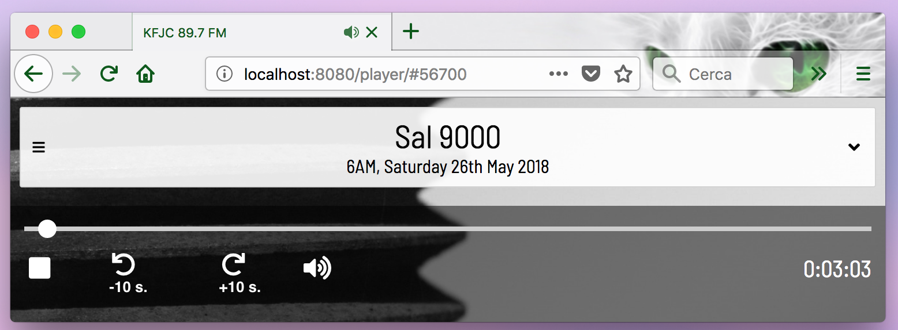

# Introduction

My enhancements to http://kfjc.org/player. So far they are:

- 'skip backward' and 'skip forward' buttons in 10 second intervals - see screenshot below.



# Getting Started

You need a local web server to avoid security restrictions on [cross-domain](https://stackoverflow.com/questions/23959912/ajax-cross-origin-request-blocked-the-same-origin-policy-disallows-reading-the) AJAX requests: your browser will prevent your local modifications to the player's HTML and javascript from making requests to KFJC's audio servers. Running a local web server allows you to make all requests to this local web server, and this web server can then proxy requests from your browser to KFJC.

## nginx

Start nginx proxy:

```
brew install nginx
nginx
```

Test with: http://localhost:8080

You should see nginx's "Welcome to nginx!" page.

You can diagnose nginx in another shell with:

```
tail -f /usr/local/var/log/nginx/*
```

## git clone

```
git clone git@github.com:ekoontz/kfjc-popup-player.git
```

## configure nginx

Edit `kfjc-popup-player/nginx.conf`: replace
`REPLACE_WITH_YOUR_YOUR_KFJC_PLAYER_DIRECTORY` with the directory where
`kfjc-popup-player` lives, (e.g. `/Users/ekoontz` for me).

Copy kfjc-configured nginx.conf to nginx directory:

```
cp kfjc-popup-player/nginx.conf /usr/local/etc/nginx
```

Restart nginx with `nginx -s reload`.


# Start browsing!

Go to: http://localhost:8080/player

You may now edit player.html or any of the CSS or Javascript files to add features or fix bugs!
